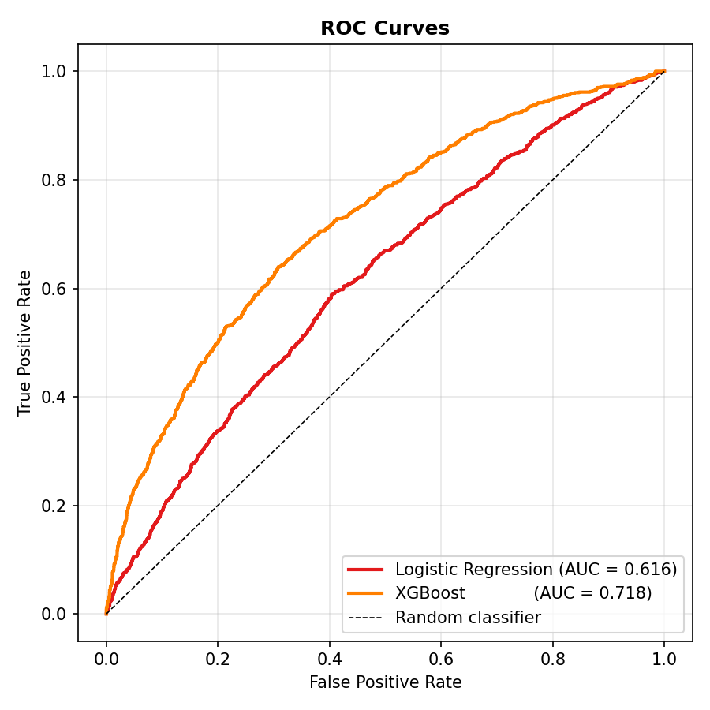
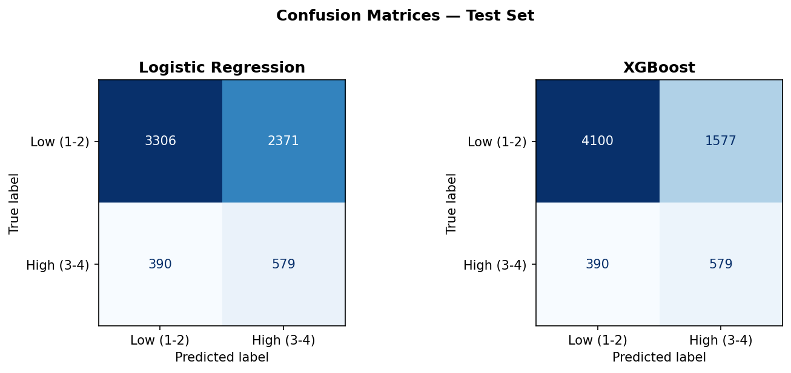
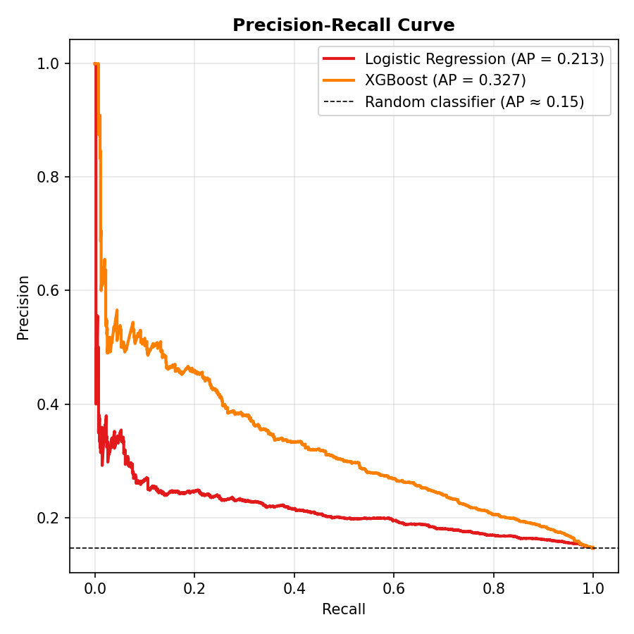
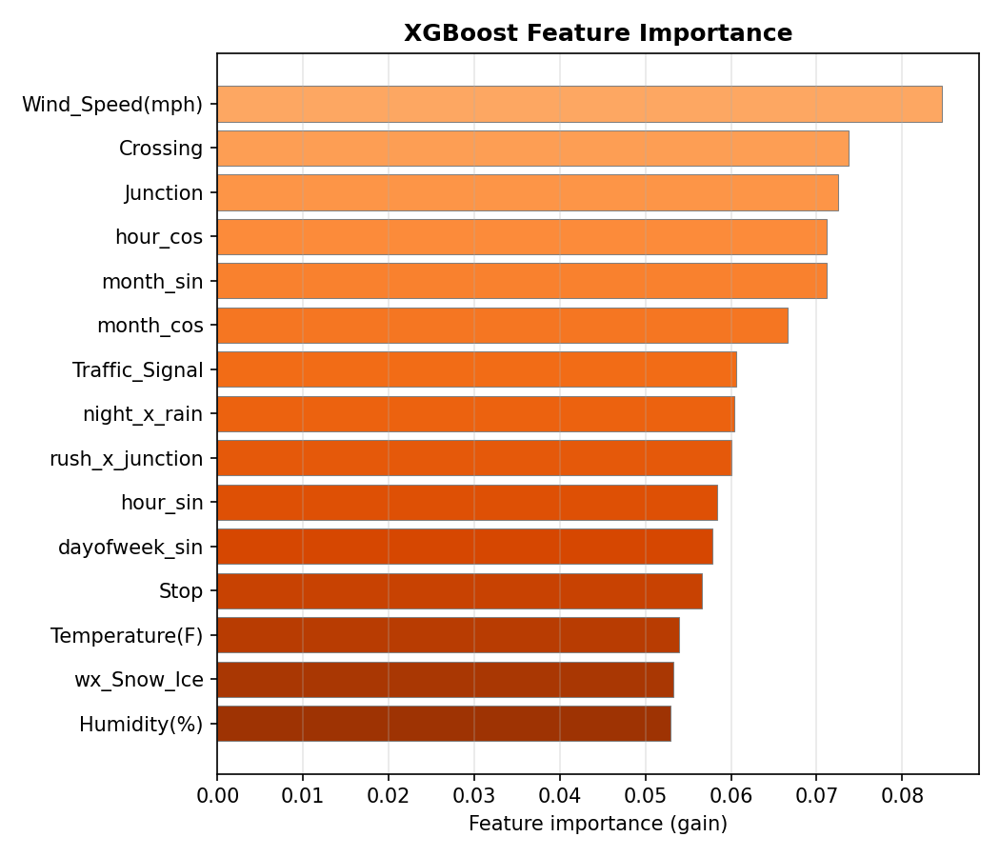
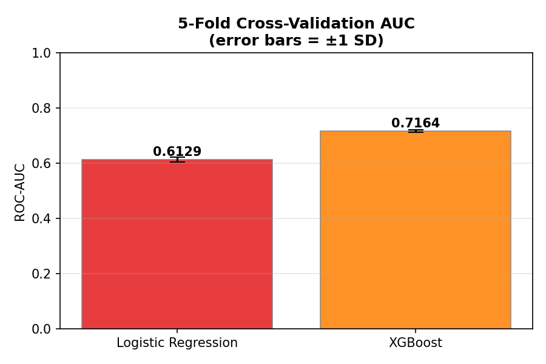

---
output:
  pdf_document: default
  html_document: default
geometry: margin=0.80in
---
# Traffic Safety Analysis on Long Island
**AMS 597 — Statistical Computing | Spring 2026**  
Shane Patandin · Matthew Tranquada · Vraj Patel · Kaushal Patel · Sur Vaghasiya  
Stony Brook University

---

## 1. Introduction

This report analyzes traffic accident patterns on Long Island using the US Accidents dataset (Moosavi et al., 2023), filtered to Nassau, Suffolk, and Queens counties. The final working dataset contains 33,228 accidents across 48 variables spanning March 2016 to March 2023. Variables cover four domains: temporal (time of day, day of week, season), weather (temperature, humidity, visibility, precipitation type), infrastructure (junction presence, traffic signals, crossings), and outcome (severity on a 1–4 scale). The dataset is imbalanced — roughly 85% of records are Severity 2.

Three research questions are addressed:

1. **[Research Question 1 — to be completed]**
2. Can unsupervised clustering reveal distinct accident archetypes on Long Island, and do those archetypes differ in severity risk?
3. Can machine learning models predict whether a crash will be high-severity (Severity 3–4) using only information available at the time of the accident?

Research Questions 1 and 2 are implemented in R (RMarkdown); Research Question 3 uses Python (Jupyter Notebook).

### 1.1 Data Preprocessing

Raw data required several cleaning steps before modeling:

- **Missing values:** Numeric weather variables were median-imputed. Precipitation was excluded from clustering models due to 20.1% missingness.
- **Outliers:** Accident duration was 99th-percentile capped and log-transformed.
- **Feature engineering:** Temporal features (hour_band, rush_hour, season, Sunrise_Sunset) and 7-level weather groupings (collapsed from 37 raw labels) were constructed. Cyclical sine/cosine encodings were applied to hour-of-day and month to avoid wrap-around discontinuities. Interaction terms (night×rain, rush_hour×junction) were added to the predictive models.
- **Lookahead exclusions:** Distance(mi) and Duration_Minutes were excluded from the predictive model since both are only measurable after a crash resolves.

---

> **[ Section 1 — Research Question 1 placeholder ]**
> *Insert the full RQ1 write-up here. Estimated length: 6–8 pages. The combined report should remain under 25 pages excluding appendices.*

---

## 2. Research Question 2: Unsupervised Accident Clustering

**Question:** Can unsupervised learning reveal distinct accident archetypes on Long Island based on weather and road characteristics, and do those archetypes differ in severity risk?

We address this through two parallel clustering tracks: **scenario clustering** asks what type of accident tends to occur under similar temporal, weather, and infrastructure conditions, while **spatial clustering** asks where crashes concentrate geographically. The two label sets are then joined to each accident for joint interpretation. Severity is excluded from all clustering inputs and used only after clustering for profiling and risk comparison.

### 2.1 Data and Feature Engineering

The clustering analysis uses the Long Island subset of the cleaned dataset, containing **33,228 accidents** across Nassau and Suffolk counties between 2016 and 2023. The raw accident table includes temporal, weather, infrastructure, and outcome variables. Before clustering, the data were transformed into a mixed-type feature set designed to capture accident context rather than post-crash outcomes.

The key engineered scenario features are summarized below.

| Domain | Features | Notes |
|---|---|---|
| Temporal (factor) | `hour_band`, `rush_hour`, `Sunrise_Sunset`, `weekday`, `weekend`, `season` | `hour_band` groups the day into six periods; rush-hour flags target 6–9 AM and 3–6 PM |
| Weather (factor) | `weather_group` | 37 raw labels collapsed to 7 groups: Clear, Cloudy, Rain, Snow/Ice, Fog/Haze, Thunderstorm, Other |
| Infrastructure | `Junction`, `Crossing`, `Traffic_Signal`, `Stop` | Boolean flags retained after zero-variance / near-zero-variance screening |
| Weather (numeric) | `Temperature(F)`, `Humidity(%)`, `Visibility(mi)`, `Pressure(in)`, `Wind_Speed(mph)` | Cleaned numeric weather inputs; sparse missing values are median-imputed when needed |
| Duration | `log_Duration` | Accident duration capped at the 99th percentile and log-transformed |

Two design decisions matter for interpretation. First, **Severity is excluded from all clustering inputs**, so the clusters are driven by observable conditions at or near the time of the crash rather than by the outcome itself. Second, **Precipitation(in)** is excluded because 20.1% of values are missing, which would otherwise force a much heavier imputation burden.

### 2.2 Methods

The clustering workflow contains a preparation layer, a scenario track, a spatial track, and an integration layer that merges both label sets back onto each accident.

\begin{center}
\includegraphics[width=1.00\linewidth]{figures/rq2_flowchart.png}
\end{center}

*Figure 1: End-to-end workflow for the clustering analysis. Preparation phases create analysis-ready features, two clustering tracks are run in parallel, and the resulting labels are joined for interpretation, explainability, and export.*

#### Scenario Clustering: k-Prototypes Baseline

We first fit a **k-Prototypes** baseline on the 17 mixed-type scenario features. Candidate values were evaluated for $k \in \{3,\dots,8\}$ with Gower range-normalisation, `nstart = 10`, and seed 42. The purpose of this baseline was to test whether a direct mixed-data clustering approach would be sufficient without dimensionality reduction.

That baseline produced weak separation, with the best silhouette at **0.1616** for $k=3$. This is below the usual 0.30 rule-of-thumb threshold for acceptable clustering quality, so the baseline was kept as a reference rather than as the final solution.

#### Scenario Clustering: FAMD + k-Means

Because the direct mixed-data approach was weak, we implemented an enhanced **FAMD + k-Means** pipeline.

1. A post-hoc Random Forest importance screen simplified the feature set to 8 higher-signal variables: `rush_hour`, `hour_band`, `Sunrise_Sunset`, `Visibility(mi)`, `weather_group`, `Humidity(%)`, `Temperature(F)`, and `season`.
2. These mixed-type variables were transformed with **Factor Analysis of Mixed Data (FAMD)** into orthogonal numeric components.
3. A grid search over component count and cluster count selected **4 FAMD components with $k=4$**, which gave the strongest silhouette width.
4. Final scenario labels were produced by **k-Means** on the 4-dimensional FAMD coordinates with `nstart = 25` and `iter.max = 100`.

This feature-importance step is used here as a model simplification aid and interpretive bridge. It is helpful, but it should not be treated as a completely independent external validation of the final clusters.

\begin{center}
\includegraphics[width=0.76\linewidth]{figures/phase5b_famd_silhouette_plot.png}
\end{center}

*Figure 2: FAMD + k-Means silhouette width across candidate cluster counts. All candidate values exceed the 0.30 threshold, with $k=4$ producing the highest score.*

\begin{center}
\includegraphics[width=0.78\linewidth]{figures/phase5b_famd_biplot.png}
\end{center}

*Figure 3: FAMD biplot (Dim 1 vs. Dim 2) coloured by cluster assignment. The four groups separate visibly in the reduced feature space, supporting the use of k-Means after dimensionality reduction.*

#### Spatial Clustering: DBSCAN

Spatial hotspots were estimated with **DBSCAN** on kilometer-projected coordinates anchored at $(40.8^\circ\text{N}, 73.2^\circ\text{W})$. A 68-combination grid search over `eps in [0.3, 2.0] km` and `minPts in {40, 50, 75, 100}` selected **eps = 1.0 km** and **minPts = 100**, yielding 12 non-noise hotspot clusters and a 15.3% noise fraction.

DBSCAN was chosen for the spatial task because it does not force every point into a cluster and is better suited to irregularly shaped corridor-like concentrations than a centroid-based alternative.

#### Integration and Post-Hoc Explanation

After both clustering stages, `scenario_cluster` and `spatial_cluster` labels were joined back onto each accident. Clusters were then profiled by severity, county, weather, and time-of-day. A Random Forest trained on the final scenario labels provided permutation-importance summaries for post-hoc explanation of the discovered archetypes.

### 2.3 Results

#### Method Comparison

| Method | k | Silhouette | Stability summary | Selected |
|---|---:|---:|---|---|
| k-Prototypes (Gower) | 3 | 0.1616 | 0.243 (Jaccard) | No |
| **FAMD + k-Means** | **4** | **0.4268** | **0.997 (ARI-based resampling)** | **Yes** |

The enhanced FAMD pipeline improved the silhouette score by about **165%** relative to the baseline and produced a much more reproducible partition under the chosen resampling procedure. This is the solution retained for scenario interpretation.

#### The Four Accident Archetypes

| Cluster | Archetype | n | Sev4 % | Night % | Weekend % | Main signal | Risk |
|---|---|---:|---:|---:|---:|---|---|
| 1 | Cloudy Off-Peak | 7,220 | 2.89 | 0 | 19 | Cloudy midday | Baseline |
| 2 | AM Rush | 16,754 | 1.75 | 13 | 10 | Rush-hour commuter pattern | Low |
| 3 | Rain AM Rush | 3,730 | 2.06 | 23 | 12 | Rain and low visibility | Baseline |
| 4 | Night / Early AM | 5,524 | 6.10 | 97 | 29 | Night / early-morning pattern | High |

The resulting scenario clusters are large enough to be interpretable and distinct enough to support meaningful profiling. Cluster 2 contains roughly half of all accidents and captures the dominant commuter pattern. Cluster 4 is much smaller, but it is the most consequential from a severity-risk perspective.

\begin{center}
\includegraphics[width=0.80\linewidth]{figures/phase9_cluster_fingerprint_heatmap.png}
\end{center}

*Figure 4: Standardized cluster fingerprint heatmap. Each row is scaled across clusters, making the dominant characteristics of each archetype easier to compare visually.*

\begin{center}
\includegraphics[width=0.68\linewidth]{figures/phase9_scenario_risk_bubble.png}
\end{center}

*Figure 5: Scenario risk bubble chart. Bubble size reflects cluster size and the vertical axis shows Severity 4 rate. Cluster 4 stands out as the clearest high-risk archetype.*

The strongest risk signal is **Cluster 4 (Night / Early AM)**. Its Severity 4 rate is **6.10%**, which is **2.21×** the dataset baseline of **2.76%**. Nearly all accidents in this cluster occur at night, and it has the highest weekend share, making it a strong candidate for late-night safety interventions. By contrast, the **AM Rush** cluster has the lowest Severity 4 rate, suggesting that high-volume commuter crashes are common but individually less severe.

#### Severity Breakdown

| Group | Sev1 % | Sev2 % | Sev3 % | Sev4 % | Sev3+4 % |
|---|---:|---:|---:|---:|---:|
| Dataset baseline | 0.48 | 84.93 | 11.83 | 2.76 | 14.58 |
| Cloudy Off-Peak | 0.17 | 86.69 | 10.25 | 2.89 | 13.14 |
| AM Rush | 0.57 | 85.75 | 11.93 | 1.75 | 13.68 |
| Rain AM Rush | 0.59 | 85.25 | 12.09 | 2.06 | 14.16 |
| Night / Early AM | 0.54 | 79.96 | 13.40 | 6.10 | 19.50 |

This table clarifies why Cluster 4 matters: it is not just slightly above baseline, but the only archetype where the combined **Severity 3 + 4** share rises to nearly **20%**. That makes it distinct from the other three clusters, which are all much closer to the overall distribution.

#### Explainability Summary

Figure 6 shows the global permutation importance from the Random Forest trained to predict cluster membership. This model is not the clustering method itself; it is an interpretation layer used to summarize which observed features most strongly distinguish the final scenario labels.

\begin{center}
\includegraphics[width=0.68\linewidth]{figures/phase8b_global_importance.png}
\end{center}

*Figure 6: Global permutation importance from a 500-tree Random Forest trained to predict cluster membership. Temporal variables dominate the ranking.*

| Rank | Feature | Importance | Interpretation |
|---|---|---:|---|
| 1 | `rush_hour` | 0.330 | Strongest global separator |
| 2 | `hour_band` | 0.151 | Finer time-of-day distinction |
| 3 | `Sunrise_Sunset` | 0.104 | Separates day and night patterns |
| 4 | `Visibility(mi)` | 0.098 | Distinguishes rainy / low-visibility conditions |
| 5 | `weather_group` | 0.045 | Separates rain from non-rain scenarios |

Temporal variables dominate the final explanation layer. In practical terms, **when** a crash occurs is more important for scenario separation than weather alone, especially in distinguishing the AM-rush and night / early-morning archetypes.

\begin{center}
\includegraphics[width=0.76\linewidth]{figures/phase8b_cluster_specific_importance.png}
\end{center}

*Figure 7: Cluster-specific permutation importance. Different archetypes are distinguished by different feature combinations: AM Rush is dominated by temporal features, Rain AM Rush is tied more strongly to visibility and weather, and Night / Early AM is defined by day–night separation.*

#### Spatial Hotspots

\begin{center}
\includegraphics[width=0.88\linewidth]{figures/phase7_spatial_hotspot_map.png}
\end{center}

*Figure 8: Spatial hotspot clusters from DBSCAN. The largest concentrations align with major Long Island travel corridors, while grey points are treated as noise by the density-based model.*

The selected DBSCAN solution produced **12 non-noise hotspots** and **15.3% noise**. The largest hotspot groups align with the **Northern State Parkway**, **Southern State Parkway**, and **I-495 / Long Island Expressway**. When cross-tabulated with the scenario labels, the **AM Rush** archetype dominates **11 of 12** non-noise hotspots, indicating that corridor-level crash volume is primarily commuter-driven.

This combination of spatial and scenario clustering is one of the most useful outputs of the chapter. A pure spatial map alone shows where crashes happen, but it does not reveal whether those crashes are mostly commuter-related, weather-driven, or late-night high-risk events. The cross-tabulation makes the hotspot map more actionable.

#### Validation Summary

| Metric | Score | Threshold / note | Verdict |
|---|---:|---|---|
| Silhouette width | 0.4268 | $\geq 0.30$ | PASS |
| ARI-based resampling score | 0.997 | Higher is more reproducible | Strong |
| ARI standard deviation | 0.0013 | Lower is better | Stable |
| RF classification accuracy | 99.6% | Post-hoc explanation model | Strong |
| DBSCAN hotspot count | 12 | Target: 3–15 | PASS |
| DBSCAN noise fraction | 15.3% | Target: 5–30% | PASS |

Overall, the scenario solution is much better separated than the baseline and the spatial solution falls within the project’s target acceptance range. The scenario validation should still be read with care because the FAMD solution is summarized with an ARI-based reproducibility measure, which is not directly identical to the baseline Jaccard stability measure.

### 2.4 Limitations

- **Feature simplification is partly post-hoc.** The Random Forest importance ranking used to simplify the FAMD feature set is helpful for interpretation, but it is not an independent external validation.
- **FAMD retains 39.8% of total variance.** This was a deliberate trade-off for clearer cluster separation, but it still means some within-cluster variation is compressed.
- **Stability metrics are not perfectly comparable across methods.** The baseline uses Jaccard stability, while the final FAMD solution is summarized using ARI-based resampling reproducibility.
- **Spatial corridor labels are heuristic.** They are based on cluster location and shape, not on formal highway shapefile matching.
- **Precipitation was excluded.** Because 20.1% of precipitation values were missing, an important weather signal was not used in clustering.
- **The analysis is observational.** The clusters describe structure in the data; they do not establish causal mechanisms.

### 2.5 Conclusion

The final clustering workflow identifies **four scenario archetypes** and **twelve spatial hotspots** on Long Island. The clearest policy-relevant finding is the **Night / Early AM** archetype, which has more than double the baseline Severity 4 rate. At the same time, the **AM Rush** archetype dominates most high-volume hotspot corridors, showing that everyday commuter crashes drive much of the system-wide burden.

Taken together, the scenario and spatial tracks provide a fuller picture of both **what kinds of crashes occur** and **where they concentrate**. That makes the clustering analysis a useful descriptive framework for targeted traffic-safety interventions, especially when the goal is to focus limited resources on the highest-risk times and places rather than on system-wide averages alone.

---

## 3. Research Question 3: Accident Severity Prediction

**Question:** Can machine learning models trained on environmental and infrastructure features predict whether a Long Island crash will be high-severity (Severity 3–4), using only information available at the time of the accident?

Two models are compared: Logistic Regression as an interpretable baseline and XGBoost as a gradient-boosted ensemble. Given the 5.86:1 class imbalance, ROC-AUC is the primary metric. F1-score on the high-severity class and the Precision-Recall curve are reported as supplementary diagnostics.

### 3.1 Data and Features

The dataset covers Nassau, Suffolk, and Queens counties. The outcome variable severity_binary bins the four-level scale into low (1–2, coded 0) and high (3–4, coded 1). The test set contains 6,646 records with 969 high-severity cases (class ratio $\approx$ 5.86:1).

Twenty-six features were constructed across four domains:

| Domain | Features | Notes |
|---|---|---|
| Weather (continuous) | Temperature, Humidity, Pressure, Visibility, Wind Speed | NAs imputed post-split |
| Temporal | hour_sin/cos, month_sin/cos, dayofweek_sin/cos, rush_hour, is_weekend, is_night | Cyclical encoding prevents hour-wrap discontinuity |
| Infrastructure | Junction, Traffic_Signal, Crossing, Stop | Boolean flags re-encoded as 0/1 |
| Weather (categorical) | wx_Cloudy, wx_Rain, wx_Snow_Ice, wx_Fog_Haze, wx_Thunderstorm, wx_Other | One-hot; Clear dropped as reference |
| Interactions | night×rain, night×fog, rush_hour×junction | Compound risk factors |

### 3.2 Modelling Approach

Data were split 80/20 with stratification on the outcome. All preprocessing (scaling, imputation) is encapsulated in scikit-learn Pipelines fitted only on training data.

**Logistic Regression:** StandardScaler → KNNImputer (k=5) → L1-penalised LR (liblinear, max_iter=500, class_weight='balanced'). Regularisation strength C tuned over {0.01, 0.1, 1.0, 10.0, 100.0} via 5-fold stratified CV on ROC-AUC.

**XGBoost:** Same preprocessing plus a SelectFromModel step (threshold = mean gain) using a preliminary 100-tree classifier to prune features. Final model uses 300 estimators, subsample=0.8, colsample_bytree=0.8, scale_pos_weight=5.86. max_depth $\in$ {3, 5, 7} and learning_rate $\in$ {0.01, 0.05, 0.1} jointly tuned via the same CV procedure.

### 3.3 Results

#### Hold-Out Performance

| Model | ROC-AUC | Accuracy | F1 (High Sev.) |
|---|---|---|---|
| Logistic Regression | 0.6165 | 0.5846 | 0.2955 |
| **XGBoost** | **0.7185** | **0.7040** | **0.3706** |

Figure 8 shows the ROC curves on the held-out test set. XGBoost dominates across the full threshold range; both models sit well above the random-classifier diagonal.

*Figure 8: ROC curves on the held-out test set. XGBoost AUC = 0.718; Logistic Regression AUC = 0.616.*

XGBoost outperforms across all three metrics. The 0.102 AUC gap points to non-linear structure that a linear model cannot fully represent even with engineered interaction terms. Accuracy is not the headline metric: a model that always predicted low-severity would hit ~85% accuracy while achieving AUC = 0.50.

Figure 9 shows the confusion matrices. Both models flag the same 579 true high-severity crashes, but XGBoost cuts false positives from 2,371 to 1,577 — a 34% reduction that accounts for most of the accuracy and F1 improvement.

*Figure 9: Confusion matrices (n = 6,646). Both models catch 579 true high-severity crashes; XGBoost generates 794 fewer false positives.*

#### Precision-Recall Analysis

Figure 10 shows the PR curves. Unlike ROC, the PR curve ignores true negatives entirely, making it a more conservative read of performance under class imbalance. Both models clear the random baseline (AP $\approx$ 0.15); XGBoost's advantage is most pronounced in the 0.0–0.4 recall range.

*Figure 10: Precision-Recall curves. XGBoost AP = 0.327; Logistic Regression AP = 0.213; random baseline AP $\approx$ 0.15.*

#### Feature Importance

Figure 11 shows the top-15 XGBoost features by mean gain. Wind Speed leads at 0.085, followed closely by Crossing and Junction. Both engineered interaction terms land in the top ten, confirming they carry signal beyond their constituent features.

*Figure 11: Top-15 XGBoost features by mean gain. Infrastructure features (Crossing, Junction, Traffic_Signal) and temporal encodings dominate alongside Wind Speed.*

#### Cross-Validation Stability

Figure 12 shows 5-fold CV AUC with error bars. CV results track test performance closely — LR at 0.6129 (±0.0059) vs. test 0.6165, XGBoost at 0.7164 (±0.0042) vs. test 0.7185 — confirming stable, generalisable models.

*Figure 12: 5-fold CV ROC-AUC with ±1 SD error bars. Tight standard deviations and close agreement with test-set results indicate neither model is overfitting.*

### 3.4 Limitations

- The data is observational. Wind Speed's top rank likely reflects correlation with broader adverse conditions not fully captured in the feature set.
- Analysis is limited to Nassau, Suffolk, and Queens. Feature importances may not transfer to other regions.
- Class imbalance was handled through loss re-weighting. Resampling methods like SMOTE weren't evaluated.
- There is no temporal holdout. A time-based split would give a cleaner picture of prospective performance.
- The default 0.5 threshold is used throughout. Any real deployment would need an explicit operating point from the PR curve.

---

## 4. Real-World Applications

Across both analyses, the inputs are all observable before a crash occurs, which means the framework naturally points toward prevention. Three application areas follow from the results.

### 4.1 Infrastructure Investment

Crossing, Junction, and Traffic_Signal rank among the top seven XGBoost features by gain, and the rush_x_junction interaction ranks ninth. Certain infrastructure types — particularly marked crossings and multi-leg junctions — are disproportionately associated with high-severity outcomes, and the effect amplifies during peak-hour congestion.

This gives Nassau County DOT, Suffolk County DPW, and NYC DOT (Queens) a way to prioritise safety capital budgets beyond simple crash-count rankings. Weighting candidate sites by predicted severity risk produces a different and more consequential ordering. Practical interventions at flagged locations could include signal timing adjustments during identified peak-risk windows, advanced warning signage approaching high-gain junctions, turn lane additions and pedestrian refuge islands at high-risk crossings, and retroreflective markings calibrated to low-visibility conditions.

The DBSCAN spatial results shown in the hotspot map sharpen the geographic targeting. The AM Rush archetype (C2) dominates 11 of 12 corridor clusters and accounts for 50% of all accidents by volume. Even at a low individual severity rate (1.8% Severity 4), the volume makes this the costliest cluster in aggregate. Congestion management and junction redesign at the densest Northern/Southern State Parkway segments would reduce the largest source of daily traffic disruption on Long Island.

### 4.2 Safety Campaigns

The clustering analysis identifies Cluster 4 (Night / Early AM) as the clearest public safety target: 17% of all accidents but a 6.1% Severity 4 rate — 2.21× the baseline. The 29% weekend share suggests recreational late-night driving contributes disproportionately to the most dangerous outcomes, which is also visible in the scenario risk profile.

Key campaign directions:

- **Nighttime messaging** focused on the 10 PM–5 AM window along the LIE and Northern/Southern State corridors, with Friday and Saturday nights as the highest-yield intervention windows.
- **Impaired-driving enforcement:** The late-night weekend profile is consistent with alcohol- and fatigue-related risk. DUI checkpoints during these hours are directly supported by the data.
- **Road lighting improvements:** C4 occurs overwhelmingly under clear conditions (mean visibility 9.5 mi), ruling out weather as the primary driver. Reduced ambient light is the differentiating factor.
- **Wet-weather campaigns:** The Rain AM Rush archetype (C3) involves 51% rain prevalence and reduced visibility. Autumn and winter campaigns reminding drivers to reduce speed in wet conditions address this cluster's profile.

### 4.3 Real-Time Driver Alerts

All XGBoost inputs — wind speed, hour, month, infrastructure type, weather conditions — are available in real time from weather APIs and map data. A (location, timestamp, weather observation) tuple could be scored against the trained model and, if the predicted high-severity probability exceeds a chosen threshold, a targeted advisory issued to navigation apps or dynamic highway signs.

This is more specific than a generic weather advisory because it accounts for infrastructure context. A driver approaching a signalised crossing during evening rush under high-wind conditions lands well above average predicted severity — a trigger that a "fog advisory" would miss entirely if fog is absent.

At the default 0.5 threshold, XGBoost achieves 0.60 recall with 0.27 precision — roughly one in four alerts corresponds to a genuinely high-severity situation. For a driver advisory system that's a reasonable operating point, and it can be shifted along the PR curve (Figure 10) depending on how conservative the deployment needs to be. The clustering model adds a complementary layer: Sunrise_Sunset and rush_hour features can trigger time-specific alert modes (e.g., heightened sensitivity after 10 PM on weekends) even before conditions deteriorate.

---

## 5. Conclusion

The clustering analysis elevated scenario clustering from exploratory (silhouette 0.16, Jaccard 0.24) to acceptable (silhouette 0.43, ARI = 0.997) by combining feature simplification with FAMD dimensionality reduction. Four accident archetypes were identified. The Night / Early AM cluster carries a Severity 4 rate of 6.1% — more than double the dataset baseline — and is the strongest risk signal in the data. DBSCAN confirmed 12 spatial hotspot clusters, with the AM Rush archetype dominating 11 of them. The central finding is that *when* you drive is the dominant risk factor on Long Island.

The severity prediction analysis showed that XGBoost (AUC = 0.718) meaningfully outperforms Logistic Regression (AUC = 0.616), with the gap driven by non-linear interactions involving wind speed, infrastructure type, and time-of-day. Infrastructure features (Crossing, Junction, Traffic_Signal) rank consistently among the top predictors, and the rush_x_junction interaction confirms that junction risk concentrates during peak hours. Cross-validation results are stable and consistent with test performance throughout.

The three application domains — infrastructure investment prioritisation, targeted safety campaigns, and real-time driver alerts — all work with information available before a crash happens. The models give agencies and designers a principled basis for deciding where and when to intervene.

### Overall Limitations

- All analyses use observational data. Identified associations do not imply causation, and unmeasured confounders (road surface condition, driver behaviour, vehicle type) may explain part of the patterns.
- Geographic scope is limited to Long Island and Queens. Findings may not generalise to regions with different road networks.
- Temporal coverage ends at March 2023 and does not reflect post-pandemic traffic shifts or recent infrastructure changes.
- Precipitation data were excluded from clustering models due to high missingness, removing a potentially important weather signal.

---

## References

Hennig, C. (2007). Cluster-wise assessment of cluster stability. *Computational Statistics & Data Analysis, 52*(1), 258–271.

Kaufman, L., & Rousseeuw, P. J. (1990). *Finding Groups in Data: An Introduction to Cluster Analysis.* Wiley.

Moosavi, S., Samavatian, M. H., Parthasarathy, S., Teodorescu, R., & Ramnath, R. (2023). A countrywide traffic accident dataset. *arXiv:1906.05409.*

Chen, T., & Guestrin, C. (2016). XGBoost: A scalable tree boosting system. *Proceedings of the 22nd ACM SIGKDD International Conference on Knowledge Discovery and Data Mining.*

Lê, S., Josse, J., & Husson, F. (2008). FactoMineR: An R package for multivariate analysis. *Journal of Statistical Software, 25*(1), 1–18.
